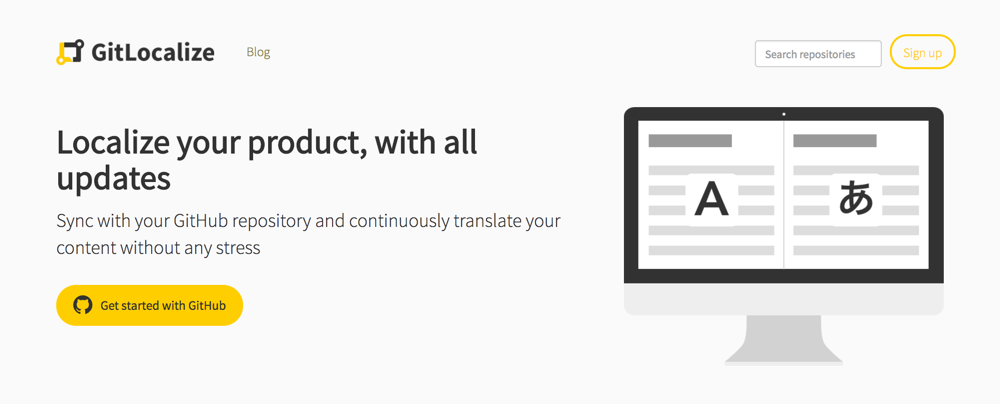
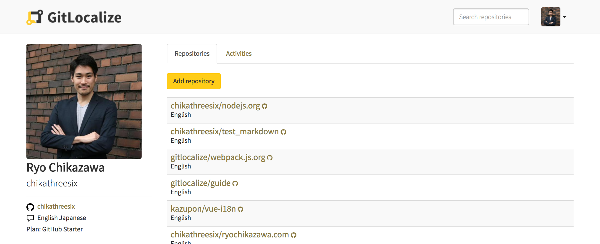
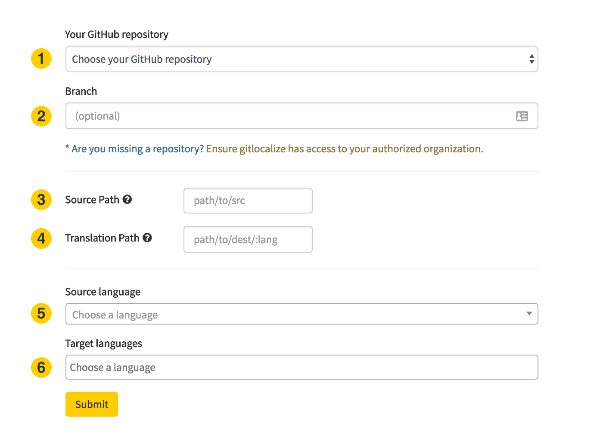

# Getting Started

Integrating your repository with GitLocalize only takes a few minutes!

## Signing up to GitLocalize

First, go to [gitlocalize.com](https://gitlocalize.com) and sign up with your GitHub account.

Click either the "Sign up" button at the top right or the "Get started with GitHub" button on the left. Next, you will be prompted to authorize your account with our OAuth app.

## Add Repository

Once you sign up, click the `Add repository` button from your page.

Fill in the form at `Add Repository` page to configure your repository environment.

1. Select your repository that you want to localize from the list.
2. Branch (Optional, default: master).
3. Path of a directory which has files you want to localize.
4. Path of a directory which GitLocalize generates translation files to.
5. Language of the source file(s).
6. Languages you want to localize to.

## Translate

After an integration, it starts to fetch target file(s) to the platform so it would take some time that depends on the size of your repository.

Once finish fetching all the target file(s), you can start translating your files with the split view editor.

It show which translation links to which original part and grays out a part which has not been translated.

## Review

After finish translating the file, `Create Review Request` button is shown up next to the status icon.

Create a review request to notify team that you have finished translating it and start a discussion there.

## Pull Request

Once your team is satisfied with your change, the language moderator can send a pull request back to the repository.
