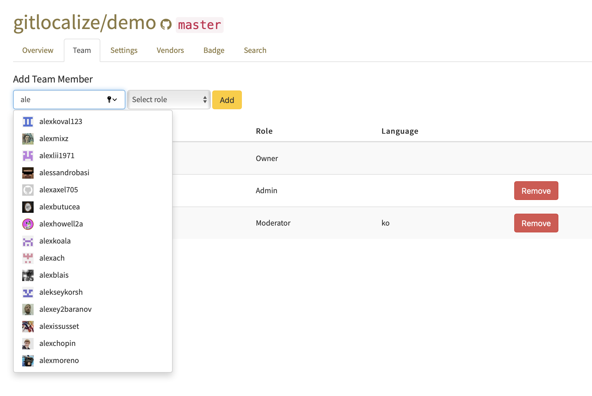

# Understanding Roles

You can add people to your project and assign roles under the Team tab on Gitlocalize.

## Adding team members

1. Start typing the GitHub handle (username) of the person you want to add to your team. Their full username will appear in the dropdown list. If that doesn't happen, the user you are trying to add doesn't have an account with GitLocalize. Please have them sign in with GitLocalize at least once using their GitHub account.

2. Select the role for the user you are adding and click Add.

## Roles

### 1. Owner

Assigned by default to the person who created the project.

### 2. Admin

Admins can manage the team (add or remove users), create or close review requests, edit translations that are awaiting review, send pull requests with translations to GitHub.

### 3. Language Moderator

Language Moderators review translations submitted by translators, can edit translations that are awaiting review and send translations to GitHub (create pull requests) - but only for the language they are moderating.

Language Moderators will also receive a notification each time new translations are added or existing translations are updated for their respective language.

Language Moderators are added per language, so if you want a user to be the Language Moderator for more than one language, you will need to add that user for each language individually.

### 4. Translator

Translators can only add or update translations and create review requests (send translations to Language Moderators for review). They will not be able to send pull requests to GitHub.

## Private vs. Public projects

Roles work the same for both private and public repositories. If, however, you are using GitLocalize for a private repository, your GitLocalize project will also be private. For this reason, you will need to make sure that each translator has access to your project by adding them to the team.

In contrast, any user can contribute to a public project, even if they are not part of the team. It makes it easier for community members to contribute to public translation projects (crowdsourced translations).
